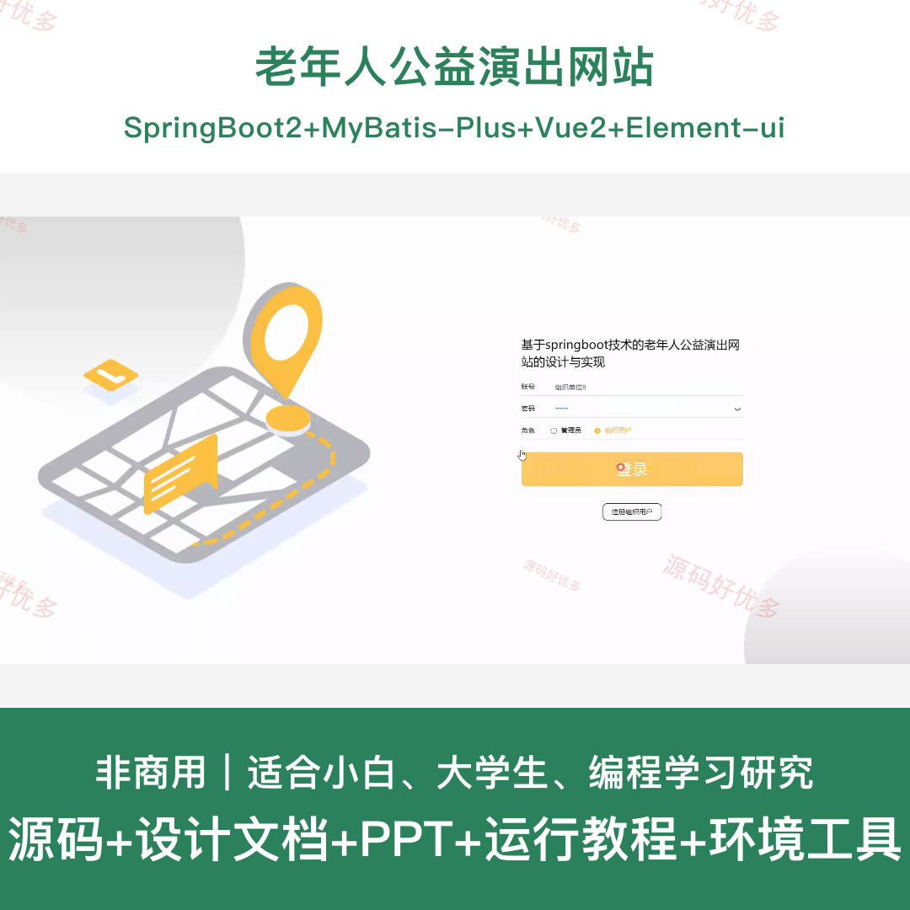
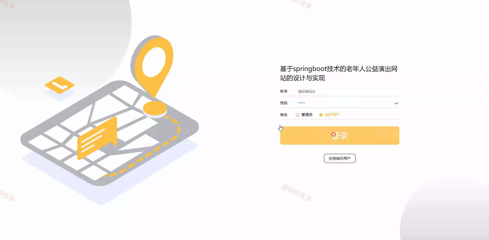
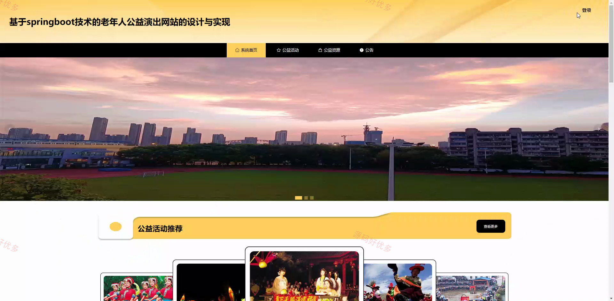
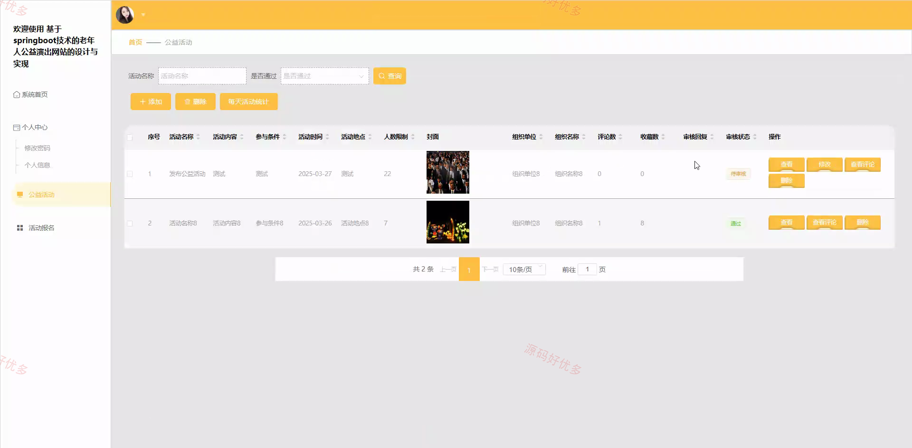
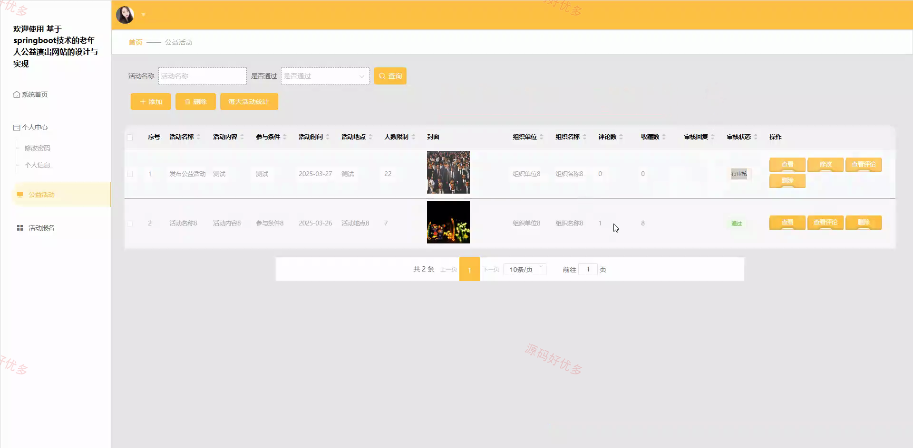
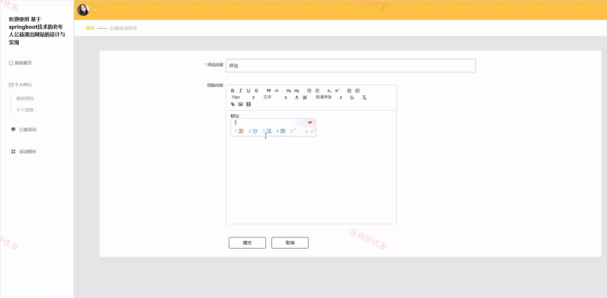
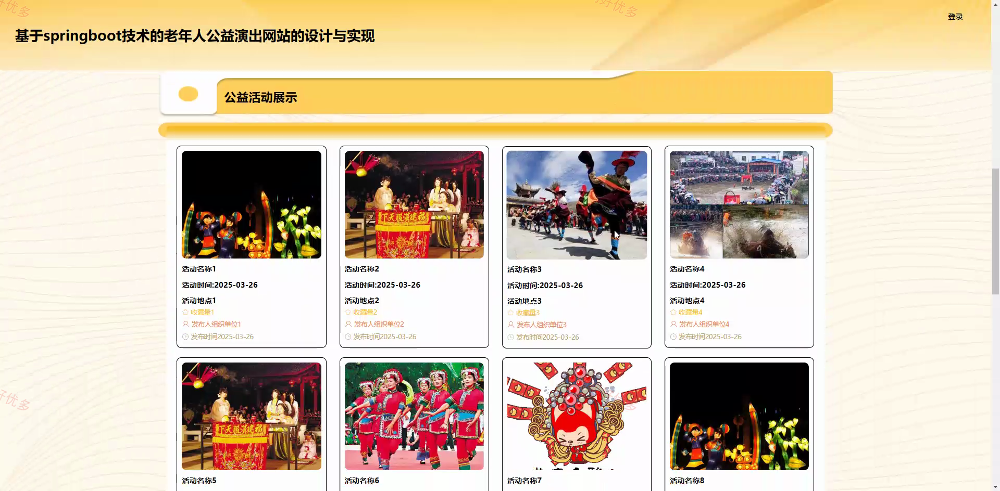
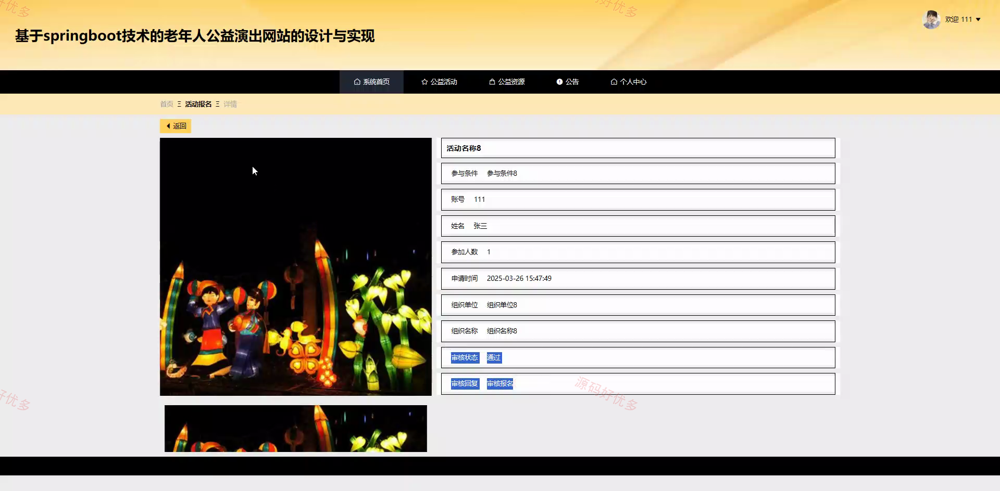
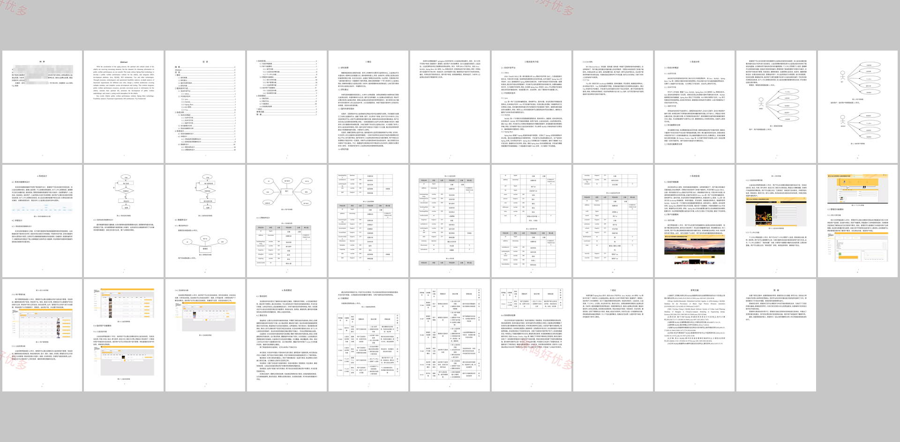

## 源码问题查看主页咨询

### 一、关键词
老年人公益演出网站、公益活动发布、活动报名审核、公益资源分享、组织用户管理

### 二、作品包含
源码+数据库+设计文档+PPT+全套环境和工具资源+本地部署教程

### 三、项目技术
前端技术： Html、Css、Js、Vue2.6、Element-ui
后端技术：Java、SpringBoot2.2.2、MyBatis-Plus

### 四、运行环境（以下版本亲测，其他版本兼容性请自行测试）
开发工具：IDEA/eclipse + VSCODE

数据库：MySQL5.7+（共14张表）

数据库管理工具：Navicat10以上版本

环境配置软件： JDK1.8 + Maven3.6.3

前端Nodejs：14+

浏览器：谷歌浏览器

### 五、项目介绍
项目编号：springbootA562D

老年人公益演出网站面向公益演出活动发布、老人参与报名与组织单位管理场景，提供公益活动展示、活动报名审核、公益资源分享、组织用户维护、新闻公告、收藏评论和在线交流等功能，便于管理员、普通用户和组织用户完成公益演出全流程管理。

角色：管理员、用户、组织用户

用户功能：注册登录、浏览公益活动和公益资源、活动报名、资源分享、收藏评论、在线咨询、个人信息维护。

管理员功能：用户管理、组织用户管理、公益活动管理、公益资源管理、报名审核、新闻公告管理、评论与基础配置管理。

### 六、运行截图

